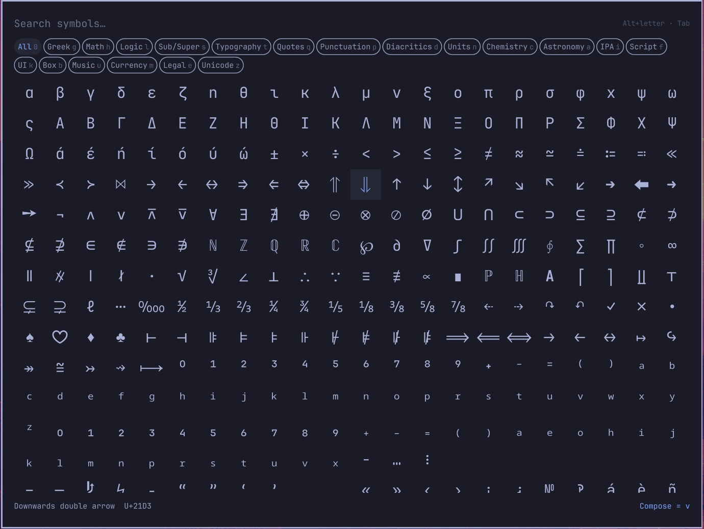

# Symbols

An Omarchy shell overlay for the symbols technical writing needs: math and logic, Greek, arrows, sub- and superscripts, IPA, box drawing, typography, currency. Type to search by name or category, Enter to insert into the focused app. The footer shows the compose sequence that types the symbol under the cursor, read from the compose tables active on your machine, so the shortcut is learned in passing and it is always one that works.

On a stock Omarchy that means the system table's sequences: `- >` for →, `< =` for ≤, `+ -` for ±. Symbols the system table has no sequence for say so. Including a richer compose file such as [xcompose-stem](https://github.com/phil-bowens/xcompose-stem), where α is `g a` and ᵃ is `^ ^ a`, is enough for the picker to show those instead; nothing in the plugin needs changing.

The curated set comes first: 468 symbols in 18 groups. Behind it sits the rest of Unicode, about 47,000 named characters, which loads on first use: pick the Unicode chip, or search for something the curated set doesn't have and the picker falls through to it. Unicode results still show a compose sequence when the character has one.



## Install

```bash
omarchy plugin add https://github.com/phil-bowens/omarchy-symbols.git --enable
```

That is the whole install: no restart, no setup. It needs `wl-clipboard` and `wtype`, which Omarchy ships.

## Open it

Press Super+Space for the Omarchy menu, type `sym`, press Enter. The plugin puts a "Symbols" row in the menu the first time it loads, under Trigger next to Emoji.

For a key, add one line to `~/.config/hypr/bindings.lua`. Hyprland applies it when you save; Super+Ctrl+U is free on a stock install and sits next to Emoji on Super+Ctrl+E:

```lua
o.bind("SUPER + CTRL + U", "Symbols", "omarchy-shell shell toggle io.github.phil-bowens.symbols")
```

## Use it

Type to search, move with the arrows, press Enter: the symbol is pasted into the app you were in and stays on the clipboard. Escape closes. Tab walks the groups, or Alt plus the letter on a chip jumps to it. The footer shows the compose sequence for the symbol under the cursor when your compose table has one.

## Remove

```bash
omarchy plugin remove io.github.phil-bowens.symbols
```

Then delete the binding line if you added one, and the "Symbols" row from `~/.config/omarchy/extensions/omarchy-menu.jsonc` if you want it gone. The plugin's only other file is a marker under `~/.local/state/omarchy-symbols/`.

## Keys

Type to filter. Arrows or Ctrl+H/J/K/L move, Page Up and Page Down jump a screen, Enter inserts, Escape clears the filter, then the chip, then closes. Click a symbol to insert it, click outside the card to close.

Chips: Tab and Shift+Tab walk them, or press Alt plus the letter shown on the chip. Where a group has an xcompose prefix the letter is that prefix, so Alt+G is Greek, Alt+H math, Alt+K UI, Alt+B box drawing, Alt+U music; the rest take a free letter, Alt+0 is All and Alt+Z is the Unicode long tail. The search text stays as you switch.

## The menu row

The first load appends one entry to `~/.config/omarchy/extensions/omarchy-menu.jsonc`:

```jsonc
"trigger.symbols": {
  "icon": "∑",
  "label": "Symbols",
  "aliases": ["symbols", "symbol", "greek", "math", "arrows", "compose"],
  "description": "Search and insert STEM symbols, with the compose sequence that types them",
  "action": "omarchy-shell shell toggle io.github.phil-bowens.symbols"
}
```

It is added only when the file has no `trigger.symbols` entry and only if the file still reads back with every other entry intact; nothing else in the file changes. The offer happens once, recorded in `~/.local/state/omarchy-symbols/`, so a row you delete stays deleted, and a row you edit is yours.

The shell never opens that file itself. `symbols-menu-entry` reads it (at most 1 MiB, a plain regular file of your own, never a link, FIFO or device, under a 5 second timeout) and replaces it by renaming a temp file created in the same directory, with the directory entered first so a swapped path cannot redirect the write. Anything it refuses leaves the file alone and still spends the offer.

## How the insert works

The symbol is placed on the clipboard and pasted with Shift+Insert into the window that had focus before the overlay opened, the way Omarchy's emoji picker inserts. It stays on the clipboard and on the primary selection afterward, so it can be pasted again. An app that does not take Shift+Insert as paste gets the clipboard copy and nothing typed. No daemon, no timer, no network, no privileges; after an insert, `wl-copy` stays resident only while the symbol is the current selection, as `wl-copy` always does.

## Data

The curated list and its groups come from xcompose-stem's `docs/xcompose_sequences.json`; `symbols.js` is generated from it:

```bash
tools/generate.py ../xcompose-stem/docs/xcompose_sequences.json symbols.js
```

Each entry carries the symbol, its name, its group and a lowercase search string. Compose sequences are not taken from this file: `compose-dump` follows `~/.XCompose` (or the file `XCOMPOSEFILE` names) and its includes, with `%L`, `%H` and `%S` expanded the way libX11 does, each time the picker opens, and `ComposeTable.js` keeps the shortest sequence for each symbol.

`unicode.json` is generated by `tools/generate-unicode.py` from Python's `unicodedata` (Unicode 16.0.0), minus CJK ideographs and invisible or combining characters. The character names in it are Unicode Data Files, distributed under the Unicode License in `LICENSE-unicode`. It ships with the plugin (2.3 MB), is read once on first use, and stays parsed for the session, about 40 MB of memory, because the overlay stays loaded the way the emoji picker does. Python is needed only to regenerate either file.

Compose results are display only; what gets inserted always comes from `symbols.js` or `unicode.json`.

### Bounds

`compose-dump` runs inside a 10 second `timeout`. It reads regular files only, so a FIFO, a device or a socket named by an include is skipped; a file larger than 8 MiB, measured on the target of a symlink, is skipped with a note in the shell log; every file is read through `head -c 8 MiB` so growth after the check or a single enormous line cannot exceed that; includes nest at most 8 deep and a cycle is read once; and the whole output passes through `head -c 4 MiB` before the shell sees it. If the dump hits its cap or its deadline, the footer says "compose table cut short" instead of claiming a symbol has no sequence.

Compose results written as a keysym name without quotes are not shown; every result in the stock tables and in xcompose-stem is a quoted string.

## Tests

```bash
test/all
```

Node tests cover the compose table parser and the shape of the generated data. Bash tests run `compose-dump` against a temporary home with nested and cyclic includes, and `symbols-insert` against fake `wl-copy` and `wtype`.

## Origins

The overlay is the shape of Omarchy's own emoji picker, which is where the grid, the key handling and the theming come from.

The full-Unicode fallback, its generator, and two of the insert script's fixes come from [EFrMG's Unicode Picker](https://github.com/EFrMG/omarchy-unicode-picker) (MIT, notice kept in `LICENSE-unicode-picker` and the generator): `wl-copy` has to be told `--type text/plain` or a single ASCII character pastes as nothing, and the symbol should stay on the clipboard after the paste. If you want the whole of Unicode without the curated layer, that plugin is the one to install. For Nerd Font glyphs there is [omarchy-icon-picker](https://github.com/CornillieJ/omarchy-icon-picker).

## Notes

Built against the Omarchy 4.0.4 shell, whose overlays are a `PanelWindow` on the overlay layer. MIT license for the plugin; the Unicode character names carry the Unicode License (`LICENSE-unicode`) and the Unicode fallback's generator carries EFrMG's MIT notice (`LICENSE-unicode-picker`). Built with Claude Code.
